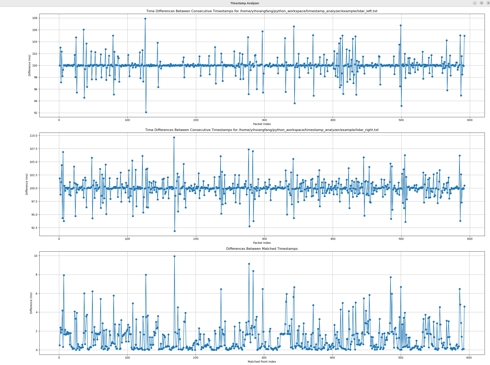

# timestamp_analyzer
This script provides a straightforward approach to analyzing timestamp differences in ROS2 messages. It visualizes the timestamp variations within a single topic and compares the differences between two distinct topics.

## Quick Start
```bash
git clone git@github.com:tier4/timestamp_analyzer.git

cd timestamp_analyzer

python3 timestamp_analyzer.py ~/timestamp_analyzer/example/lidar_left.txt  ~/timestamp_analyzer/example/lidar_right.txt
```



## How to use
```bash
# Terminal 1
ros2 topic echo YOUR_TOPIC_1 --field header > topic1.txt

# Terminal 2
ros2 topic echo YOUR_TOPIC_2 --field header > topic2.txt

# After the rosbag ended
python3 timestamp_analyzer.py topic1.txt topic2.txt
```
